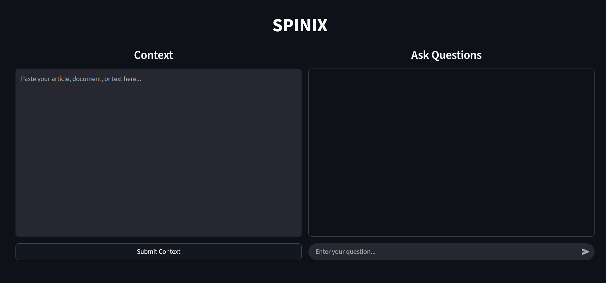

# SPINIX
> <i> Talk to your documents with context-aware AI</i>.

<p>SPINIX is a lightweight, extractive Question Answering (QA) system. It allows users to provide a specific context (like an article or a report) and ask questions to extract precise information using the distilbert-base-cased-distilled-squad model from Hugging Face.  </p>



## Installation & Setup

### 1. Install the dependencies 
* <b>Prerequisite :</b>`python-3.10` or above.

All necessary dependencies are listed in the `requirements.txt` file.

```bash
pip install -r requirements.txt
```
### 2.  Run the app 
```bash
streamlit run app.py
````

